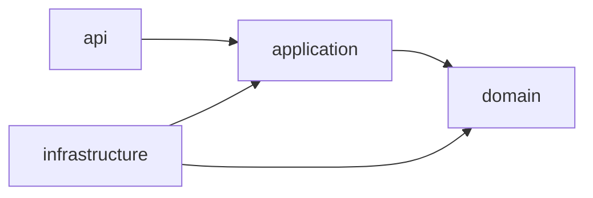
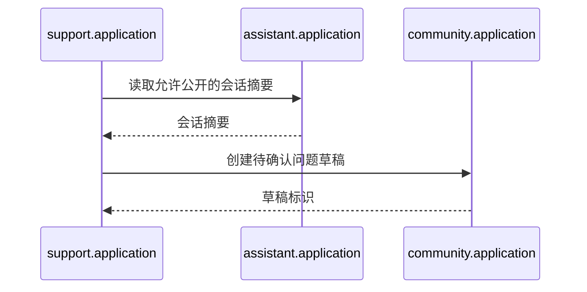

# ChinaMate 后端模块化单体架构

## 1. 目标

后端采用轻量模块化单体：只有一个 Maven module、一个 Spring Boot 进程、一个可执行产物和一个 MySQL 数据源，但业务代码按明确领域边界组织。

这套结构主要解决两个问题：

1. 避免账号、攻略、AI 和社区代码逐渐堆入全局 `controller/service/mapper` 目录。
2. 让一个人配合 AI Coding 时，每次变更能够缩小到清晰模块，并通过机器测试发现跨域误改。

“轻量”表示不提前引入微服务和分布式设施，不表示省略业务规则、权限、事务、安全或测试。

## 2. 模块地图

| 模块 | 负责 | 不负责 |
| --- | --- | --- |
| `account` | 账号、凭据、会话、用户偏好、旅行上下文 | 攻略、AI 会话、社区内容 |
| `guide` | 攻略、双语版本、来源、收藏、反馈 | AI 生成、社区讨论、媒体存储 |
| `assistant` | AI 会话、消息、知识引用、风险、额度、解决反馈 | 直接修改社区问题 |
| `community` | 问题、回答、单层评论、最佳回答、解决状态 | 模型调用、审核处置 |
| `support` | AI 转社区草稿、官方求助、升级流程 | 保存 AI 消息或社区持久化细节 |
| `moderation` | 举报、审核、内容处置、账号限制、审计记录 | 拥有攻略或社区核心数据 |
| `notification` | 站内通知、未读状态 | 决定核心业务事件是否成立 |
| `media` | 图片校验、存储引用、保留期限、删除编排 | 解释图片业务含义 |

`ProjectApplication`、`config` 和 `health` 是应用技术入口。`shared` 不是默认目录，只有存在真实跨模块技术复用时才创建。

## 3. 模块内部结构

子 package 按实际代码需要创建：

```text
com.heness.project.<module>/
├── api/             # HTTP 协议、校验、Request、Response
├── application/     # 用例、命令、查询、事务、端口、应用事件
├── domain/          # 领域对象、值对象、状态转换、策略、仓储端口
└── infrastructure/  # MyBatis、Spring AI、对象存储等适配器
```

不要求一次创建全部四层，也不使用空 Service、空接口或空实现占位。

### 3.1 依赖方向



必须遵守：

- `domain` 不依赖 `api`、`application`、`infrastructure`、Spring MVC、MyBatis 或 Spring AI。
- `application` 可以依赖本模块 `domain`，不能依赖 `api` 或具体基础设施实现。
- `api` 只通过应用用例执行业务，不直接调用 Mapper、数据库行对象或 `ChatModel`。
- `infrastructure` 实现应用层或领域层声明的端口，不依赖 `api`。
- API DTO、应用结果、领域对象、数据库行对象分别建模。

### 3.2 类命名建议

按用例命名类，避免巨型 `XxxService`：

```text
RegisterAccountHandler
UpdateTravelContextHandler
SearchGuidesQueryService
PublishGuideHandler
SendAiMessageHandler
SelectBestAnswerHandler
```

外部或可替换边界使用明确端口：

```text
AccountRepository
PasswordHasher
ChatModelPort
KnowledgeSearchPort
ImageStoragePort
```

不要机械创建 `XxxService`、`XxxServiceImpl`、`IBaseService` 等成对样板。

## 4. 跨模块协作

跨模块只能调用目标模块公开的 `application` 契约。禁止调用目标模块的 Controller、领域内部、Mapper、数据库行对象或基础设施实现。

AI 会话转社区草稿的正确方向：



错误做法包括：

- `support` 直接查询 AI 消息表。
- `support` 调用 `CommunityQuestionMapper`。
- `assistant` 和 `community` 相互调用内部实现。
- 为跨模块通信提前增加消息队列。

核心流程默认使用同步应用调用。通知、埋点等非核心副作用可以在事务成功后触发；外部模型、网络、文件和对象存储 I/O 不得放在数据库事务中。

## 5. `shared` 边界

代码进入 `shared` 前必须同时满足：

1. 至少两个模块真实使用。
2. 两处语义完全一致。
3. 无法合理归属某个业务模块。

允许候选包括统一 Web 错误、认证上下文、可观测性、时间和标识能力。禁止放入业务对象、业务状态、DTO、Mapper、仓储、`BaseService`、`BaseController` 或万能 `Utils`。

少量重复优先于错误抽象。首次出现的辅助能力留在所属模块，等真实复用出现后再评估上移。

## 6. 资源目录

```text
src/main/resources/
├── db/migration/          # 仅 Flyway 管理数据库结构
├── mapper/<module>/       # 业务模块 MyBatis XML
├── prompts/<module>/      # 可版本化 Prompt
└── messages*.properties   # 国际化消息
```

- 数据库结构只能由新的 Flyway migration 修改。
- MyBatis SQL 显式列出所需字段，业务值使用 `#{}` 参数绑定。
- `${}` 只允许受服务端封闭白名单控制的标识符或 SQL 片段。
- 大段 Prompt 不得硬编码在 Controller。

## 7. 测试分层

| 层次 | 目标 | 是否启动 Spring |
| --- | --- | --- |
| Domain 单元测试 | 状态转换、业务不变量、策略 | 否 |
| Application 用例测试 | 编排、端口调用、事务外行为 | 通常否 |
| API 测试 | 校验、权限、状态码、错误契约 | Web 测试上下文 |
| 持久化集成测试 | Flyway、Mapper、MySQL 行为 | 是，使用真实 MySQL/Testcontainers |
| 完整上下文测试 | 启动配置与少量主流程 | 是 |

架构规则：

```bash
./mvnw -Dtest=ArchitectureRulesTests test
```

完整后端测试：

```bash
./mvnw test
```

`ArchitectureRulesTests` 当前检查层次方向、跨模块入口、循环依赖、Controller 隔离、Domain 框架隔离、Spring AI 归属、`shared` 边界和非 JPA 技术栈。静态架构测试不能替代业务、安全和数据库集成测试。

## 8. 新增代码检查清单

1. 先根据业务含义选择唯一的顶层模块。
2. 判断代码属于协议、应用编排、领域规则还是基础设施。
3. 只有真实替换边界才新增接口。
4. 跨模块只使用目标模块应用契约。
5. 数据结构变化创建新 Flyway migration。
6. MyBatis XML 和 Prompt 放入所属模块资源目录。
7. 先写失败测试，再写最少实现。
8. 运行相关测试、完整测试和 `git diff --check`。
9. 修改模块边界时同步更新本文件与架构测试。

## 9. 明确禁止的模式

- 全局 `controller/service/mapper/entity` 目录。
- Controller 直接调用 Mapper 或 `ChatModel`。
- 模块直接访问另一个模块的数据表映射实现。
- Spring Data JPA、JPA entity、`JpaRepository`、Criteria API、`@DataJpaTest`。
- 业务对象和业务 DTO 进入 `shared`。
- 为未来需求预建大量接口、空实现或通用基类。
- 未经 OpenSpec 确认拆 Maven module、微服务、数据库或消息系统。

## 10. 未来拆分条件

模块增多本身不是拆微服务的理由。只有持续出现以下证据时才提出独立 change：

- 某模块需要与主应用明显不同的扩缩容策略。
- 故障必须与主应用隔离并有明确 SLO。
- 出现独立团队、独立发布节奏和稳定数据所有权。
- 单体部署或数据库成为监控数据证明的瓶颈。

可能优先拆分的是图片处理、模型调用任务或知识索引，而不是账号和攻略核心业务。拆分前先保持端口与数据归属清晰，不提前支付分布式复杂度。
